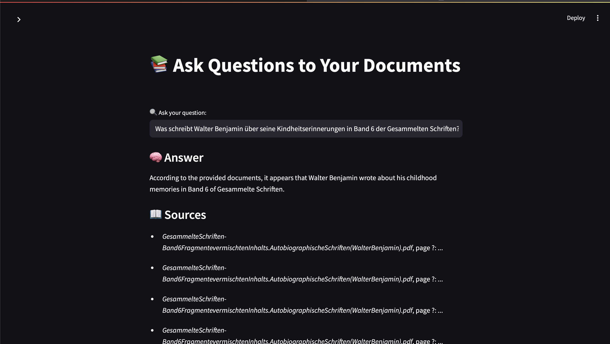

# 📚 LLM Document Agent

A fully local Retrieval-Augmented Generation (RAG) pipeline for answering complex questions from your personal document library using LLMs.

## 🚀 Features

* ✅ Load and parse your PDF/EPUB documents with persistent cache
* ✅ Semantic chunking and embedding via multilingual-e5-base
* ✅ Fast retrieval powered by FAISS index
* ✅ LLM-backed question answering using Ollama + Llama3
* ✅ Elegant Streamlit UI with document selection and chunk citation
* ✅ Shell-based full pipeline execution
* ✅ Pythonic, extensible, and fully offline-ready

## 📦 Installation

```bash
# Setup environment
conda create -n llm-rag python=3.9 -y
conda activate llm-rag

# Clone the repository
git clone https://github.com/YOUR_USERNAME/LLM_Document_Agent.git
cd LLM_Document_Agent

# Install dependencies
pip install -r requirements.txt

# Pull Ollama model
ollama pull llama3
```

## 🛠️ Usage

```bash
# Step 1: Put PDFs/EPUBs into docs/
# Step 2: Run full pipeline
bash run_pipeline.sh

# Step 3: Launch Web UI
streamlit run app/web_ui.py
```

## 🔍 Example Queries

* What is the main idea behind Walter Benjamin's theory of history?
* How does Hayao Miyazaki reflect on 1984 in his essays?
* According to the AWS Solutions Architect Guide, how is IAM configured?

## 🧠 Architecture Overview

1. `parser.py` – parses PDFs/EPUBs with filename-safe cache
2. `chunk_embed.py` – splits, embeds, and builds FAISS index
3. `rag_chain.py` – queries vector DB and constructs prompt
4. `web_ui.py` – Streamlit-based frontend for interactive QA

All components are connected via clean, modular interfaces.

## 📸 Screenshot



## 📁 Directory Structure

```
LLM_Document_Agent/
├── app/
│   └── web_ui.py
├── ingest/
│   ├── parser.py
│   └── chunk_embed.py
├── query/
│   └── rag_chain.py
├── llm_utils/
│   └── indexer.py
├── docs/
├── store/
├── .parsed_cache/
├── requirements.txt
└── README.md
```

## 🔐 License

MIT License

---

> This repo was built to demonstrate how personal knowledge and logic reasoning can be enhanced locally using cutting-edge LLMs without leaking data to external servers.
